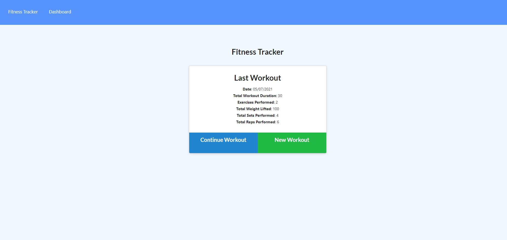
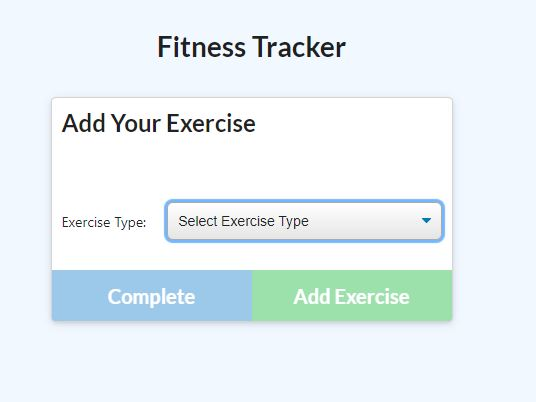
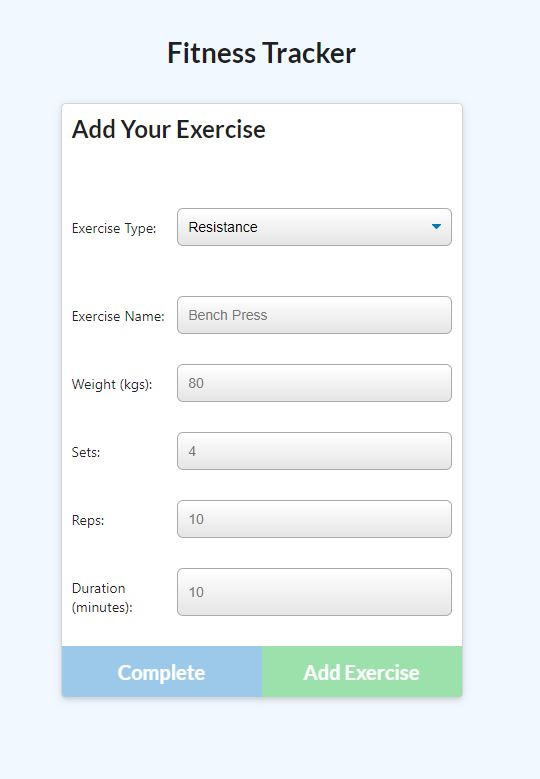
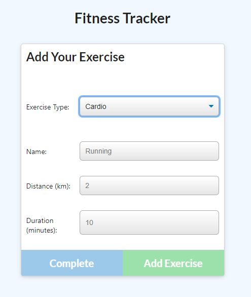
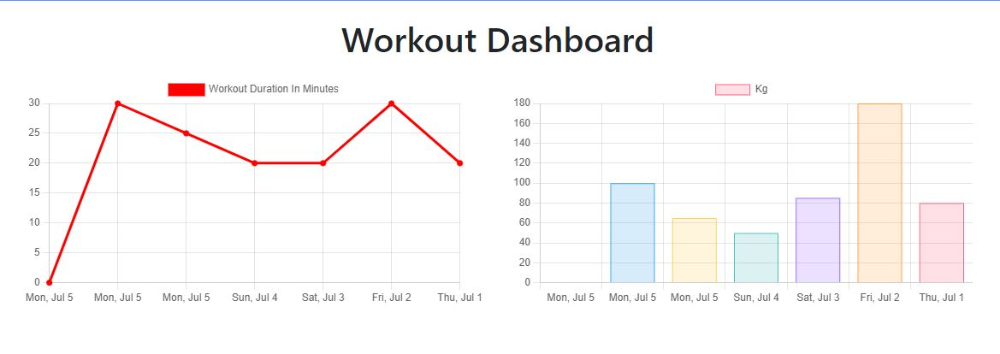

# Workout Tracker 

  [](https://opensource.org/licenses/Apache-2.0)

  ## Table of Contents
  - [Description](#description)
  - [Installation](#installation)
  - [Usage Information](#usage-information)
  - [License](#license)
  - [Contribution Guidelines](#contribution-guidelines)
  - [Test Procedure](#test-procedure)
  - [Questions](#questions)
  - [Images](#images)

  ## Description
  A Workout Tracker where you can view, create and track daily workouts and also have the ability to log multiple exercises in a workout on a given day. You can track the name, type, weight, sets, reps and duration of the exercise. You can also log your cardio and track your distance travelled. This application use a Mongo Database with a Mongoose schema and routes are handled with Express.

  Link to the [Workout Tracker](https://workout-trackerb.herokuapp.com/)

  ## Installation
  ```
  - npm i 
  - npm run seed 
  - npm start
  ```

  ## Usage Information
  Use this application to track your Workouts, whether it be a resistance based workout or a cardio based workout

  ## License
  APACHE 2.0

  ## Contribution Guidelines
  Contribute freely

  ## Test Procedure
  n/a

  ## Questions
  If you have any questions, then feel free to contact me on the below:
  - Github: [bdjm94](https://github.com/bdjm94)
  - Email: [brendandjmoore@gmail.com](brendandjmoore@gmail.com)

    ## Images
| Home Page |
|------------|
  

| Add Exercise Page |
|------------|
  

| Resistance Workout Page |
|------------|
  

| Cardio Workout Page |
|------------|
  

| Workout Dashboard |
|------------|
  

